<h1 align="center">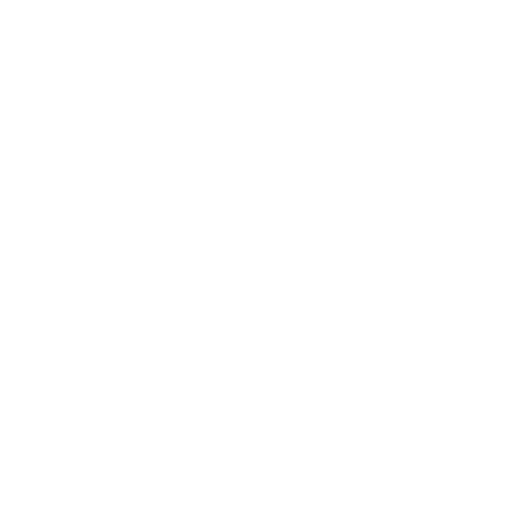 Goat Bot - Bot Chat Messenger</h1>

	
  
  
  
  

* [`Prerequisites`](#-prerequisites)
* [`Tutorial`](#-tutorial)
* [`Support`](#-support)
* [`Support Languages`](#-support-languages)
* [`Common Problems`](#-common-problems)
* [`Screenshots`](#-screenshots)
* [`Copyright (C)`](#-copyright-c)
* [`License`](#-license)

## 🚧 Prerequisites
- [Node.js 16.x](https://nodejs.org/en/download/)

## 📝 Tutorial
#### A Tutorial has been uploaded on YouTube, Watch it by clicking on the image down below
- Replit.com: https://www.youtube.com/watch?v=nTIT8OQeRnY
- VPS/Windows:

## 📙 Support
#### If you have major coding issues with this bot, please join and ask for help.
- https://www.facebook.com/groups/goatbot
- https://www.facebook.com/groups/goatbot/permalink/493150412403231

## 📚 Support Languages

- [x] `en: English`
- [x] `vi: Vietnamese`

- Change language in `config.json` file
- You can customize the language in the folder `languages/`, `languages/cmds/` and `languages/events/`

## 📌 Common Problems

	

		📌 Error 400: redirect_uri_mismatch
		
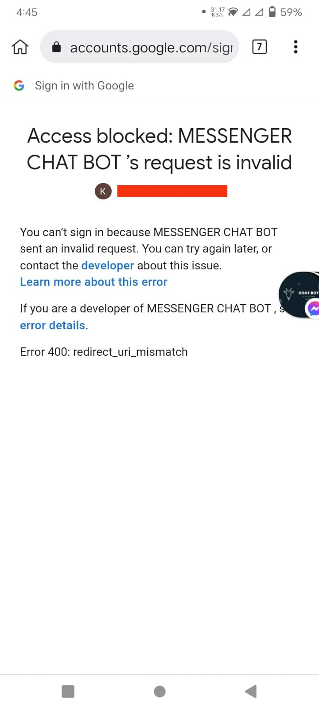
 
	

	
1. Enable Google Drive API: <a href="https://youtu.be/nTIT8OQeRnY?t=347">Tutorial</a>

	
2. Add uri <a href="https://developers.google.com/oauthplayground">https://developers.google.com/oauthplayground</a> (not <a href="https://developers.google.com/oauthplayground/">https://developers.google.com/oauthplayground/</a>) to <b>Authorized redirect URIs</b> in <b>OAuth consent screen</b> <a href="https://youtu.be/nTIT8OQeRnY?t=491">Tutorial</a>
  
	
3. Choose <b>https://www.googleapis.com/auth/drive</b> and <b>https://mail.google.com/</b> in <b>OAuth 2.0 Playground</b>: <a href="https://youtu.be/nTIT8OQeRnY?t=615">Tutorial</a>

	

		📌 Error for site owners: Invalid domain for site key
		
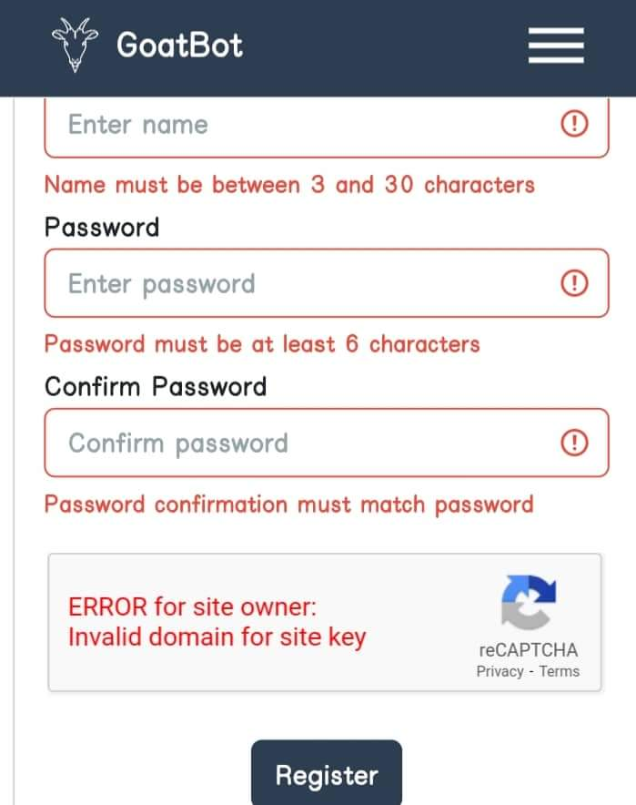

	

		
1. Go to <a href="https://www.google.com/recaptcha/admin">https://www.google.com/recaptcha/admin</a>

		
2. Add domain <b>repl.co</b> (not <b>repl.com</b>) to <b>Domains</b> in <b>reCAPTCHA v2</b> <a href="https://youtu.be/nTIT8OQeRnY?t=698">Tutorial</a>

	

		📌 GaxiosError: invalid_grant
		
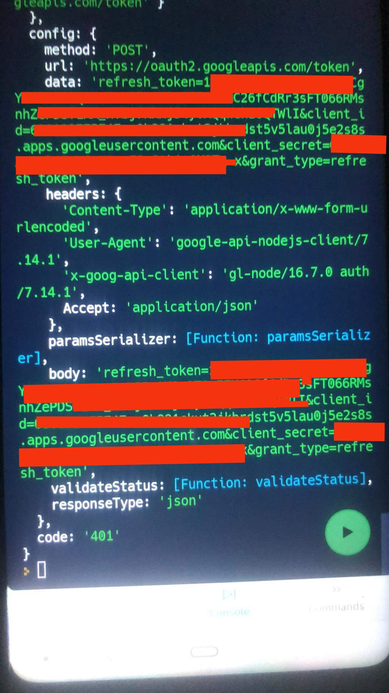

		
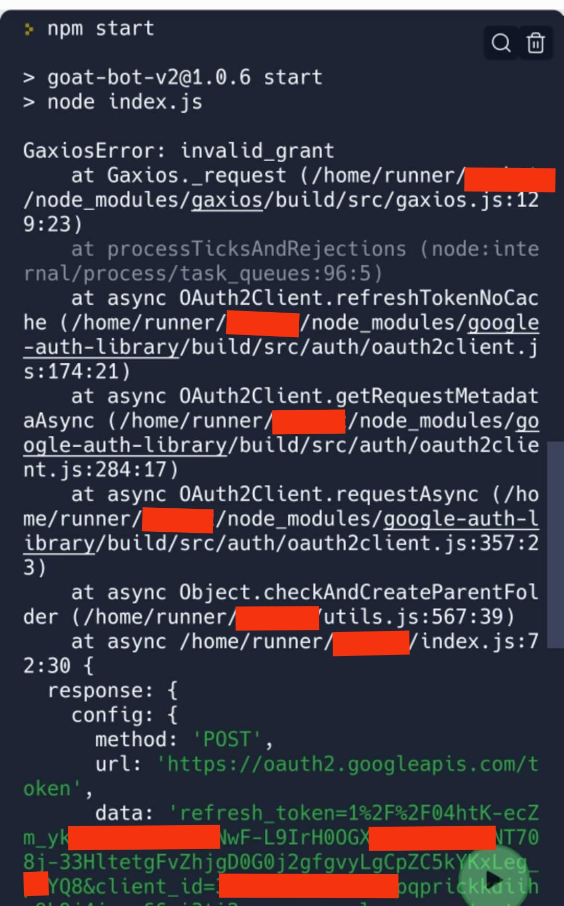

	

		
- if you don't publish the project in google console, the refresh token will expire after 1 week and you need to get it back. <a href="https://youtu.be/nTIT8OQeRnY?t=445">Tuatorial</a>

## 📸 Screenshots
### Bot
#### Rank system
- Rank card:

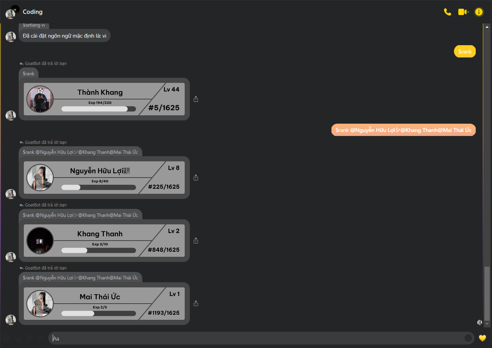

- Rankup notification:

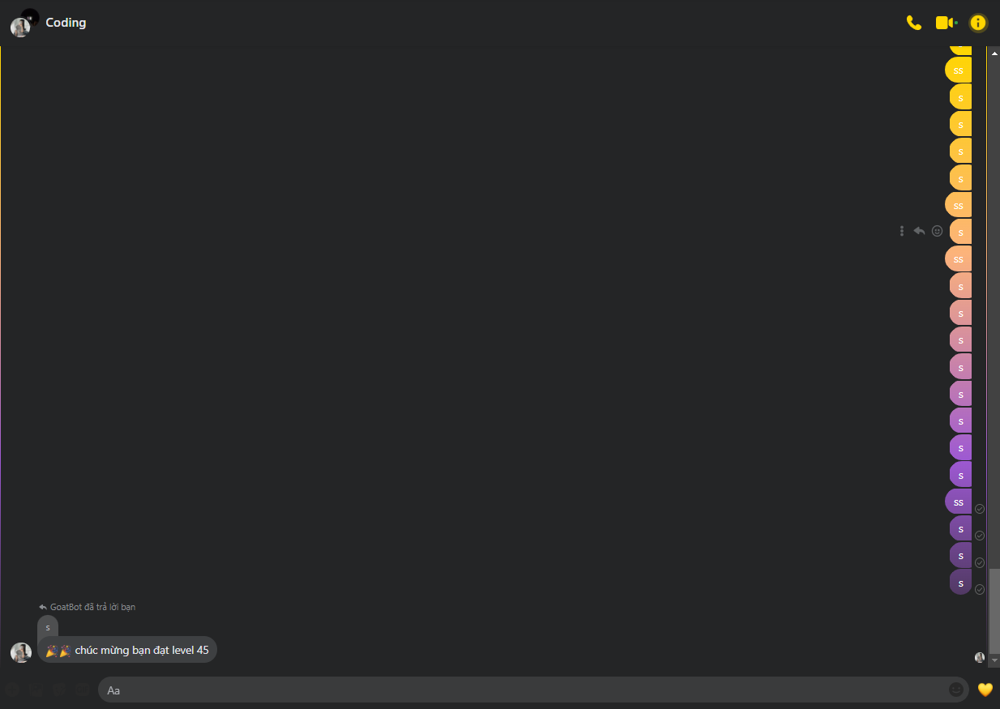

- Custom rank card:

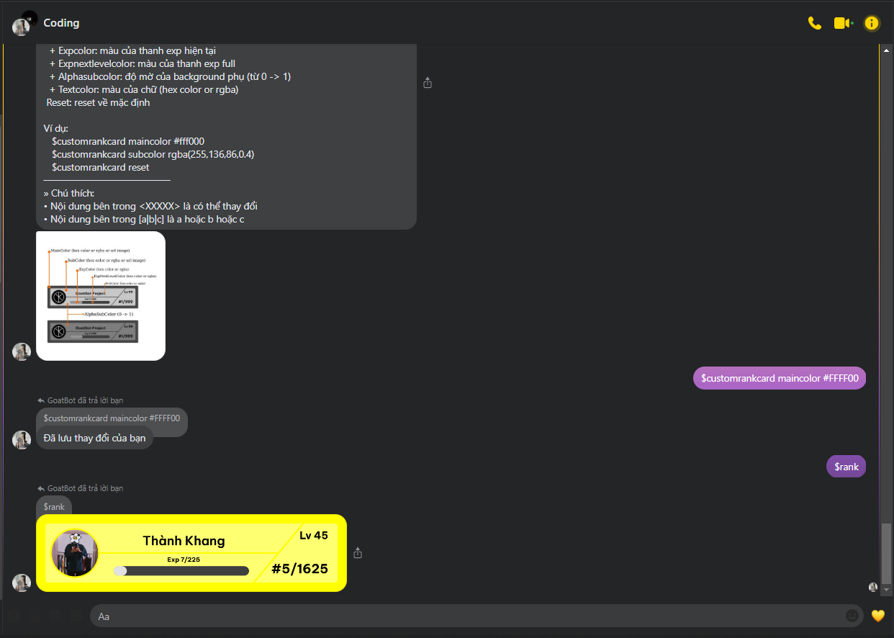

#### Weather:

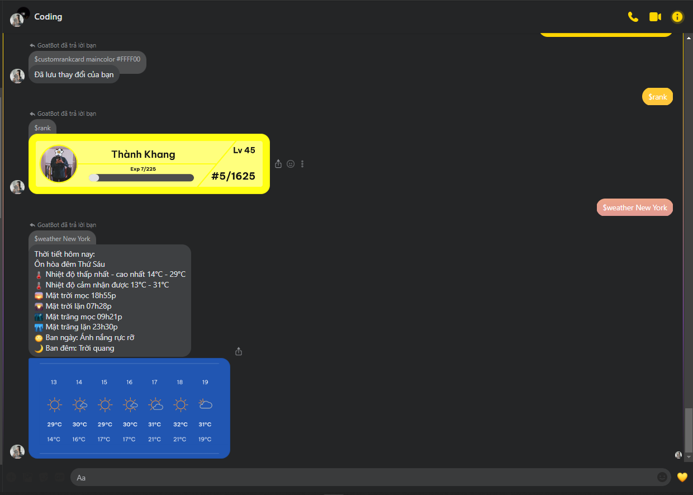

#### Auto send notification when have user join or leave box chat (you can custom message):

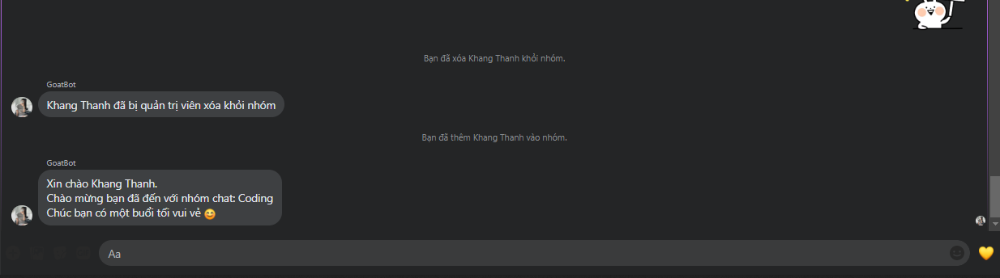

### Dashboard
- #### Home:

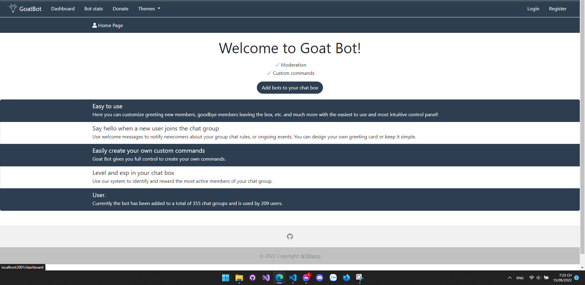

- #### Stats:

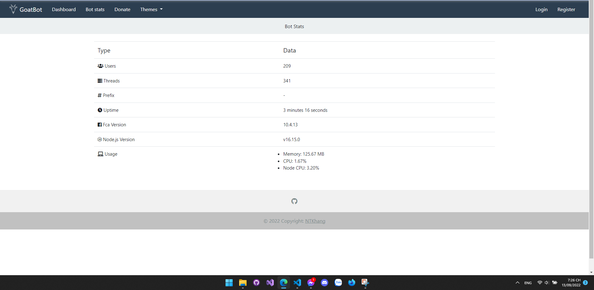

- #### Login/Register:

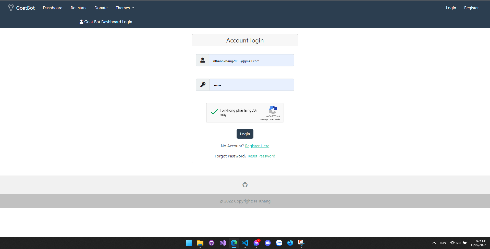

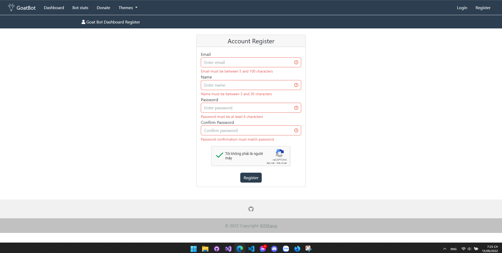

- #### Dashboard Thread:

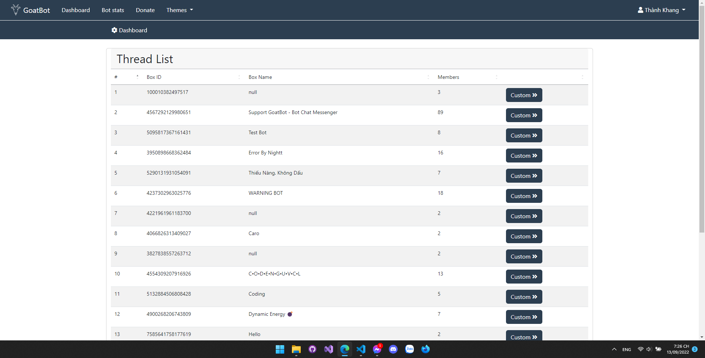

- #### Custom on/off:

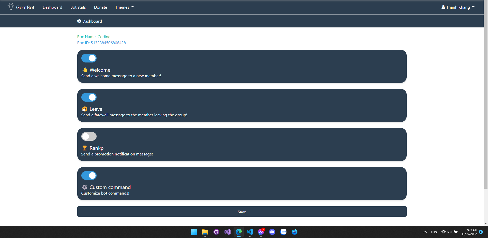

- #### Custom welcome message (similar with leave, rankup (coming soon), custom command (coming soon))

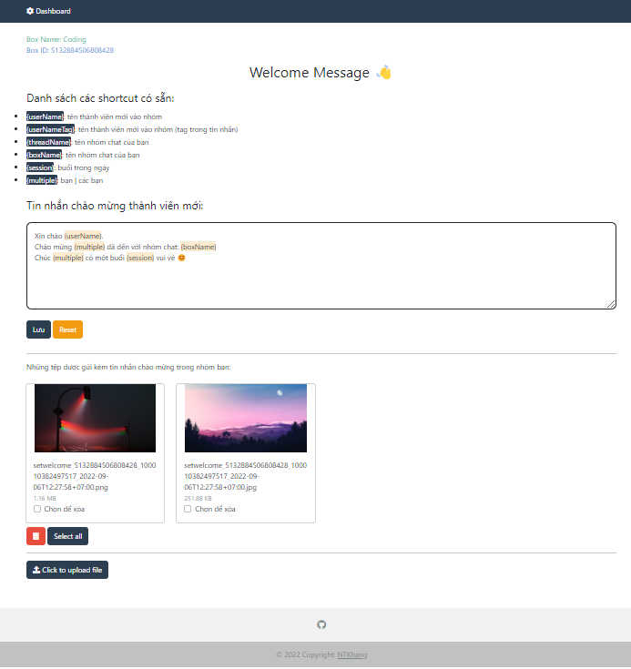

## ✨ Copyright (C)
### [NTKhang (NTKhang03)](https://github.com/ntkhang03)

## 📜 License
### If you violate any rules, you will be banned from using my project
- Don't sell my source code
- Don't remove/edit my credits
